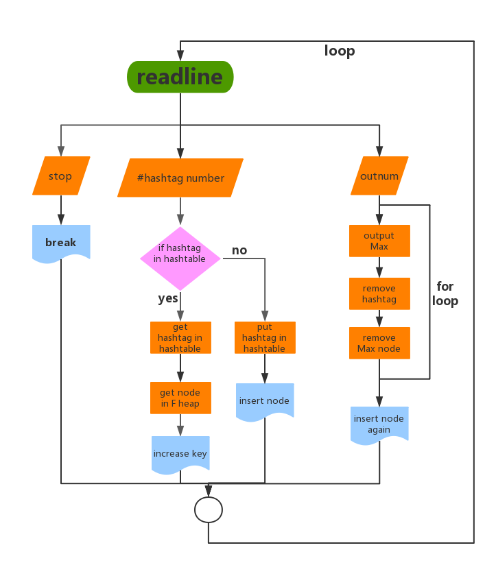

# HashtagCounter

This is a project using mas Fibonacci heap to find the n most popular hashtags appeared on social media.

UF COP 5536 Advanced Data Structures Fall 2016 Programming Project


## Description

The system can find the n most popular hashtags appeared on social media such as Facebook or Twitter. And the hashtags will be given from an input file. 

Basic idea for the implementation is to use a max priority structure to find out the most popular hashtags.

Two useful structures:

1. Max Fibonacci heap: use to keep track of the frequencies of hashtags.

2. Hash table: Key for the hash table is hashtag and value is pointer to the corresponding node in the Fibonacci heap.

You can assume there will be a large number of hashtags appears in the stream and you need to perform increase key operation many times. Max Fibonacci heap is required because it has better theoretical bounds for increase key operation.

## Data Structure of the Project

The project requires to find the n most popular hashtags. There will be a large number of hashtags appears in the stream and the increase key operation will be performed many times, so Max Fibonacci heap is required because its better theoretical bounds for increase key operation.

Besides, in order to increase key of a node in Max Fibonacci heap, we need to search the node in Max Fibonacci heap. To realize searching function, I use Hash table to link the hashtag name with the pointer to the corresponding node in heap. 


Each hashtag is put in the key of hashtable, and the value is the pointer to Fibonacci node.

Also, hashtable can help to distinguish different hashtags. If the new hashtag is already in the hash table, it need to find the hashtag in hashtable, and search the corresponding node. Implement the increase key operation to this node. If the new hashtag is not in the hash table, this new node should be insert to the Fibonacci heap.


## Input and Output

The program take the input file name as an argumenmt.

```bash
java hashtagcounter sampleInput.txt
```

### Input Format
Hashtags appear one per each line in the input file and starts with # sign. After the hashtag an integer will appear and that is the count of the hashtag (There is a space between hashtag and the integer). You need to increment the hashtag by that count. Queries will also be appeared in the input file and once a query appears you should append the output to the output file. Query will be an integer number (n) without # sign in the beginning. You should write the top most n hashtags to the output file. Once it reads the stop (without hashtag) program should end. Following is an example of an input file.

```
#saturday 5 
#sunday 3 
#saturday 10 
#monday 2 
#reading 4 
#playing_games 2 
#saturday 6 
#sunday 8
#friday 2 
#tuesday 2 
#saturday 12 
#sunday 11 
#monday 6 
3
#saturday 12 
#monday 2 
#stop 3 
#playing 4 
#reading 15 
#drawing 3 
#friday 12 
#school 6 
#class 5
5 
stop
```

### Output Format
Once a query is appeared you need to write down the most popular hashtags of appeared number in to the output file in descending order. Output for a query should be comma separated list without any new lines. Once the output for a query is finished you should put a new line to write the output for another query. 

Following is the output file for the above input file.

```
saturday,sunday,monday
saturday,sunday,reading,friday,monday
```

## Program Structure




